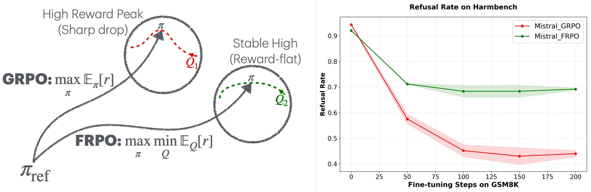

# **Robust Policy Optimization to Prevent Catastrophic Forgetting**

## Abstract
Large language models are commonly trained through multi-stage post-training: first via RLHF, then
fine-tuned for other downstream objectives. Yet even small downstream updates can compromise earlier
learned behaviors (e.g., safety), exposing a brittleness known as catastrophic forgetting. This suggests
standard RLHF objectives do not guarantee robustness to future adaptation. To address it, most prior work
designs downstream-time methods to preserve previously learned behaviors. We argue that preventing this
requires pre-finetuning robustness: the base policy should avoid brittle high-reward solutions whose reward
drops sharply under standard fine-tuning.

We propose Fine-tuning Robust Policy Optimization (FRPO), a robust RLHF framework that optimizes
reward not only at the current policy, but across a KL-bounded neighborhood of policies reachable by
downstream adaptation. The key idea is to ensure reward stability under policy shifts via a max-min
formulation. By modifying GRPO, we develop an algorithm with no extra computation, and empirically
show it substantially reduces safety degradation across multiple base models and downstream fine-tuning
regimes (SFT and RL) while preserving downstream task performance. We further study a math-focused RL
setting, demonstrating that FRPO preserves accuracy under subsequent fine-tuning.


## Getting started
Installation:

```
pip install -r requirements.txt
pip install flash-attn==2.7.3 --no-build-isolation
```
>**Note:** flash-attn requires --no-build-isolation and must be installed separately as shown above.

## Experiments
### 1. Training (FRPO / GRPO)
We provide training scripts for both experimental settings from the paper.

Safety training (Mistral / Qwen on harmful + harmless prompts):
```
bash training/bash/safety_training.sh
```

Math training (Qwen2.5-Math-7B on MATH levels 3–5):
```
bash training/bash/math_training.sh
```
The FRPO trainer (`training/frpo_trainer.py`) is a subclass of TRL's `GRPOTrainer`. You must set `loss_type="frpo"` and pass lamb (the $\lambda$ parameter from the paper) with or without "baseline" and "jackknife" to use it. The bash files include the training of both GRPO and FRPO with multiple values of $\lambda$.

### 2. Downstream Fine-tuning
After training, we fine-tune the resulting models to evaluate robustness. Scripts are in `finetuning/bash/`:

| Script | Setting | Description |
| :--- | :--- | :--- |
| `SFT_alpaca.sh` | SFT on Alpaca | Tests safety presevation under instruction-tuning |
| `SFT_gsm8k.sh` | SFT on GSM8K | Tests safety presevation under math fine-tuning |
| `SFT_nvidiacode.sh` | SFT on OpenCodeInstruct | Tests math accuracy presevation under code fine-tuning |

### 3. Evaluation
We use two external evaluation frameworks, which must be installed separately:

- lm-evaluation-harness — for MATH500, MMLU, IFEval, and other benchmarks
- EvalPlus — for MBPP+ and HumanEval+

```
pip install lm-eval evalplus
```
Bash scripts are in `eval/`. 

-----
Safety evaluations (HarmBench refusal rate, StrongREJECT scores) are computed using the utilities in `finetuning/harmbench_utils.py` and `finetuning/sr_utils.py`. Additionally, `finetuning/kl_utils.py` measure the rewards (Safety and Heplfulness) as well as the KL with the reference model during fine-tuning.


